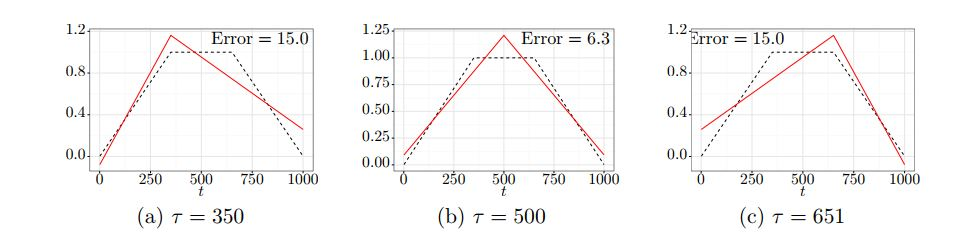

Narrowest-Over-Threshold (NOT) Detection of Multiple Change-Points and Change-point-like Features
========================================================
author: Bruno Grillo e Renan Cintra
date: Porto Alegre, abril de 2021.
Séries Temporais (PPGEst - UFRGS)

Organização do Artigo
========================================================
 <font size="4">
**1.Introduction**: Motivação, Contexto, Objetivos

**2. The framework of NOT: (Setup, Main Idea, Log-Like ratios and Cont.functions, NOT algorithm, Theoretical properties)**
- Descrição matemática do NOT
- Considerações do NOT em quatro cenários distintos, com diferentes formas de quebra estrutural (média e/ou variância)
- Função contraste tailor-made obtida a partir da razão de verossimilhança generalizada (GLR - general likelihood ratio)
- Propriedades teóricas do NOT, como consistência e taxas de convergência

**3. NOT with the strengthened Schwarz Information Criterion (sSIC) (Motivation,Algorihtm2, Choice Contrast Function sSIC, Theoretical properties of NOT with the sSIC, Computational complexity, Other practical considerations)**

 - NOT com critério de informação fortificado, sSIC (strengthened Scharwz Information Criterion) 
 - Discussão de aspectos computacionais e propriedades teóricas
 
**4. NOT under different noise types (NOT under dependent noise, Extension of NOT heavy-tailed noise)**

**5.Simulation study**

**6.Real data analysis**

</font>

Algoritmo - NOT - Objetivo
========================================================

- Parte de um modelo simples para detectar “pontos de mudança” (ou mudanças na descrição paramétrica de uma $f_t$ ) que ocorrem em locais desconhecidos

\begin{equation}
 Y_t = f_t + \varepsilon_t, \qquad  t = 1, \dots, T
\end{equation}

- A abordagem proposta também permite detectar "features" a partir de aspectos distributivos de $\varepsilon_t$  (ex: variância do erro)

- Os tipos de mudança considerados a partir de uma descrição paramétrica de $f_t$.

- Num nível mais amplo, propõe-se a ideia de utilizar modelos simples nos subconjuntos da amostra (*local*) e depois agregar os resultados para obter um ajuste geral (*global*)


Algoritmo - NOT - Método
========================================================
<font size="5">
- **Global**: tira-se várias subamostras $Y_{s+1}, \dots, Y_{e}^{'}$, onde $0 \leqslant s < e \leqslant T$ 
  - Em cada subamostra, assume-se que apenas uma *feature* está presente e emprega-se uma função contraste feita *sob medida* obtida para encontrar o ponto/localização mais provável dessa feature.
  - Mantém-se as subamostras para qual a função contraste excede um limite (*threshold*) definido pelo usuário e descarta-se as demais.

- **Local**: das subamostras retidas, busca-se a que tem o intervalo mais curto (narrowest interval), ou seja, a que tem $e - s$ com menor valor. 
  - Ao detectar uma *feature*, o algoritmo avança recursivamente para “esquerda” e “direita” do ponto e para no intervalo onde não encontra-se nenhum outro intervalo cujo contraste exceda o threshold.
</font>


Algoritmo - NOT - Framework
========================================================
<font size="5">
Considerando $\boldsymbol{Y} = (Y_1, \dots ,Y_T)'$, dado por

\begin{equation}
Y_t = f_t +\sigma_t \varepsilon_t,  \qquad  t = 1, \dots, T
\end{equation}

Onde $f_t$ é o sinal, $\sigma_t$ é o desvio padrão do ruído, $\varepsilon_t$ é o resíduo (nesta etapa considera-se que segue uma distribuição Normal com média 0 e desvio-padrão unitário).

- Assume-se que o par $f_t$ e $\sigma_t$ pode ser particionado em $q+1$ segmentos, onde $q$ é o número de pontos de mudança desconhecidos e está entre o início e fim do vetor de observação da série temporal ($0 = \tau_0 < \tau_1 < \dots < \tau_q < \tau_{q+1} = T$). 

- Para cada intervalo $j = 1, …, q+1$ gerado pelos segmentos, modela-se parametricamente $\boldsymbol{\Theta_j}$ a subamostra por um vetor de parâmetros *d*-dimensional com valores pertencentes aos reais, onde d é conhecido e geralmente pequeno.

- Requer-se que a distância mínima entre dois pontos de mudança seja $\geqslant d$ por questões de identificação (identifiability). Ex: ao considerar uma função com mais de 3 parâmetros, não será possível estimá-la com um ou dois pontos.

</font>
<!--  -->
<!-- ```{r, echo=FALSE} -->
<!-- plot(cars) -->
<!-- ``` -->


Algoritmo - NOT - Framework
========================================================
<font size="5">
Ou seja, o par $f_t$ e $\sigma_t$ pode ser dividido em $q+1$ segmentos  cada um deles da mesma família paramétrica de estrutura muito mais simples. Exemplos de estruturas (Cenários):

- **(S1) Variância constante, média constante por partes**:
    $$\sigma_t = \sigma_0 \qquad e \qquad f_t = \theta_j \qquad para \qquad t = \tau_{j-1} +1, \dots, \tau_j$$

-  **(S2) Variância constante, média contínua e linear por partes**:
    $$ \sigma_t = \sigma_0 \qquad e \qquad f_t = \theta_{j,1} +\theta_{j,2} \qquad  para \qquad t = \tau_{j-1} +1, \dots \tau_j$$
    com restrições de
    $$\theta_{j,1}+\theta_{j,2}\tau_j = \theta_{j+1,1}+\theta_{j+1,2} \tau_j \qquad para \qquad j =1, \dots, q$$
    
- **(S3) Variância constante, média linear por partes (mas não necessariamente contínua)**:
$$ \sigma_t = \sigma_0 \qquad e \qquad f_t = \theta_{j,1} +\theta_{j,2} \qquad  para \qquad t = \tau_{j-1} +1, \dots \tau_j$$ e
$$f_{tau_j} + \theta_{j,2} \neq f_{tau_j+1}$ para $j = 1, \dots, q$$

    
- **(S4) Variância constante por partes, média constante por partes**:
$$f_t = \theta_{j,1} \qquad e \qquad \sigma_t = \theta_{j,2} >0 \qquad  para \qquad t = \tau_{j-1} +1, \dots \tau_j$$ 


</font>
